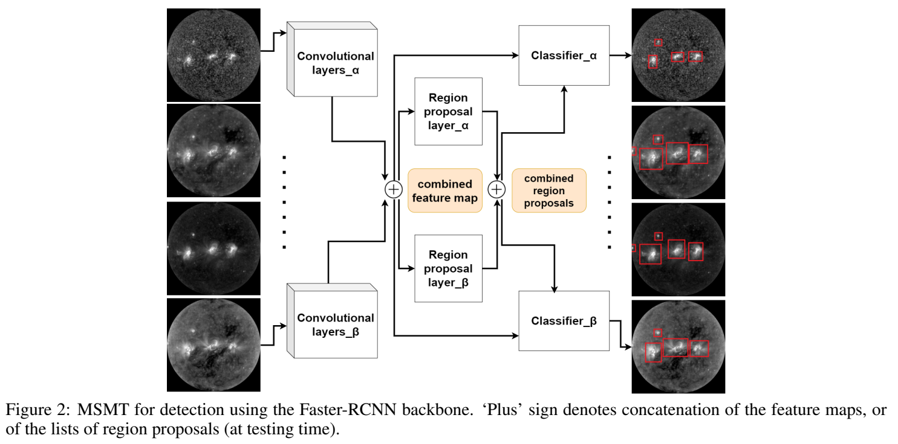
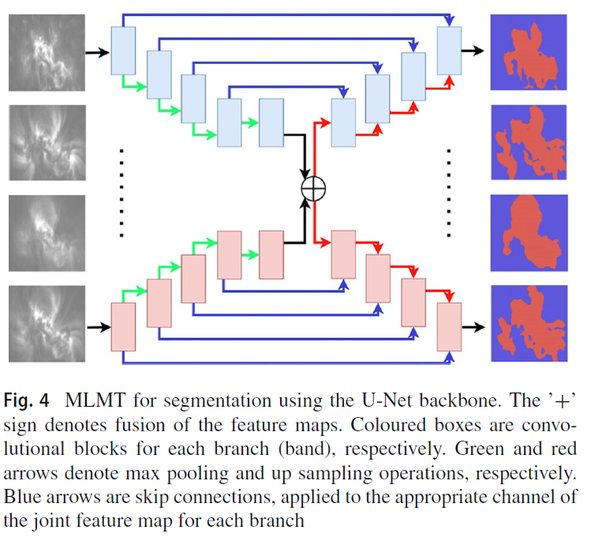

## MLMT-CNN - Object Detection and Segmentation in Multi-layer and Multi-spectral images


This repository contains the implementation of the research work [MLMT-CNN - Object Detection and Segmentation in Multi-layer and Multi-spectral images](https://doi.org/10.1007/s00138-021-01261-y). 

### Abstract
<div style="text-align: justify;">
Precisely localising solar Active Regions (AR) from multi-spectral images is a challenging but important task in understanding solar activity and its influence on space weather. A main challenge comes from each modality capturing a different location of the 3D objects, as opposed to typical multi-spectral imaging scenarios where all image bands observe the same scene. Thus, we refer to this special multi-spectral scenario as multi-layer. We present a multi-task deep learning framework that exploits the dependencies between image bands to produce 3D AR localisation (segmentation and detection) where different image bands (and physical locations) have their own set of results. Furthermore, to address the difficulty of producing dense AR annotations for training supervised machine learning (ML) algorithms, we adapt a training strategy based on weak labels (i.e. bounding boxes) in a recursive manner. We compare our detection and segmentation stages against baseline approaches for solar image analysis (multi-channel coronal hole detection, SPOCA for ARs) and state-of-the-art deep learning methods (Faster RCNN, U-Net). Additionally, both detection and segmentation stages are quantitatively validated on artificially created data of similar spatial configurations made from annotated multi-modal magnetic resonance images. Our framework achieves an average of 0.72 IoU (segmentation) and 0.90 F1 score (detection) across all modalities, comparing to the best performing baseline methods with scores of 0.53 and 0.58, respectively, on the artificial dataset, and 0.84 F1 score in the AR detection task comparing to baseline of 0.82 F1 score. Our segmentation results are qualitatively validated by an expert on real ARs.
</div>


<div align="center">
    
    
</div>


## Dataset

The dataset used in this project is available at: [https://zenodo.org/records/7950721](https://zenodo.org/records/7950721).


## Installation

To clone the repository and set up the environment, follow these steps:

**Clone the Repository**:
   ```bash
   git clone https://github.com/MjdMahasneh/MLMT-CNN-for-object-detection-and-segmentation-in-multi-layer-and-multi-spectral-images.git
   cd MLMT-CNN-for-object-detection-and-segmentation-in-multi-layer-and-multi-spectral-images
   ```

**Install Required Libraries: Install the dependencies listed below using pip:**
```bash
pip install numpy opencv-python matplotlib tensorflow keras
```

**Usage**

To run the code, follow these steps:
- Download the dataset from Zenodo.
- run the `test.py` file.
    
    ```bash
    python test.py
    ```


## Citation

If you use this repository, please consider citing the following works:

1. [MLMT-CNN - Object Detection and Segmentation in Multi-layer and Multi-spectral images](https://doi.org/10.1007/s00138-021-01261-y)
2. [Active Region Detection in Multi-spectral Solar Images](https://www.scitepress.org/Link.aspx?doi=10.5220/0010310504520459)
3. [MSMT-CNN for Solar Active Region Detection with Multi-Spectral Analysis](https://doi.org/10.1007/s42979-022-01088-y)
